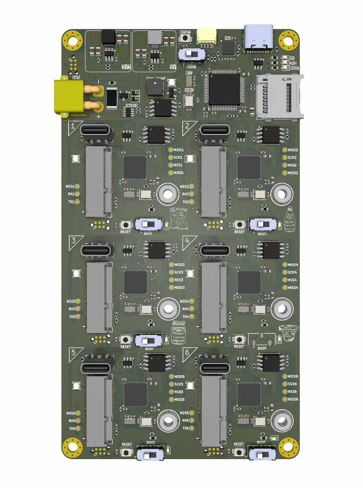
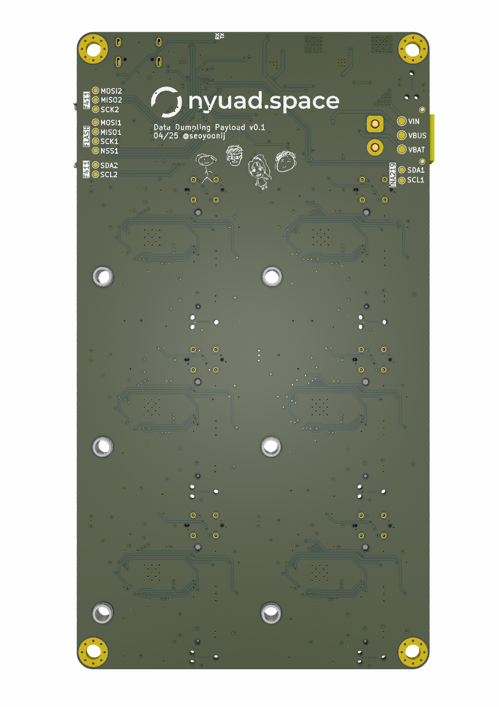

## Hardware Errata v1 (2025)

- Pull down Boot1 instead of floating. For booting F405 with DFU, hold down the 3rd reset button.
- SWD TagConnect: Layout is too close to XT30 or M.2 sockets and connector is difficult to source.
- DRC check (recheck unconnected items).
- Look out for "x"ed POS in the BOM file. May have been accidentally toggled off.
- Reset button is too small & hard to reach
- Vertical USB is less stress-tolerant (pulls on solder)
- STM32F411 DFU bootloading error
- Check forward current rating for Schottky diodes.
- Consider using more current sensors i.e. Measure current draw from each board, from VIN total etc.
- Add in extra LEDs, buttons, etc. for extra functions/debugging in the future
- Unless saving space is a priority, consider using 0603 instead of 0402 for easier potential fixes
- Misc. Consider a more impact-tolerant casing to protect board upon landing

# Data Dumpling

  
  

Data Dumpling is a modular, high-speed data logger for MEMS sensors, designed as a payload for our experimental sounding rocket Stage Fright (2025). It enables real-time characterization and benchmarking of commercial sensors in demanding flight environments. The project aims to support sensor research and promote scalable, plug-and-play architectures for future space missions.

---

## Features

- **Modular Architecture**: Hot-swappable M.2 sensor ports with dedicated coprocessors  
- **Sensor Compatibility**: Supports I2C/SPI sensors with auto-detection via WHO_AM_I or equivalent registers  
- **Dedicated Flash Memory**: Each sensor board logs to onboard 16MB non-volatile memory  
- **Universal Firmware**: One firmware for all sensor types—detects, initializes, logs, and stores automatically  
- **Flight-Triggered Logging**: Dual-buffered flash logging triggered by flight detection events  
- **Core MCU**: STM32F405 manages flight readiness and triggers; STM32F411 handles individual sensor boards  
- **Post-Flight Retrieval**: Optionally offloads sensor data to SD card after recovery  

---

## Applications

- Benchmarking MEMS sensors in realistic aerospace environments  
- Development of sensor fusion algorithms and accurate sensor models  
- Modular data collection for experimental payloads  
- Plug-and-play architecture for custom flight computers and high-speed telemetry systems  

---

## Mainboard Components

| Type        | Components                                    |
|-------------|-----------------------------------------------|
| Main MCU    | STM32F405RGT                                  |
| Coprocessor | STM32F411CEU6                                 |
| IMUs        | LSM6DSO32, BMI088                              |
| Barometers  | DPS310XTSA1, BMP390L                           |
| Magnetometer| LIS2MDLTR                                      |
| Temperature | HDC3022DEJR                                    |
| Flash       | 16MB SPI NOR Flash per sensor board           |
| Recovery    | SD card slot for post-flight data offload     |

---

## Firmware Overview

Each STM32 microcontroller is programmed via built-in USB DFU bootloader.

### Main Processor (STM32F405)
- Communicates with MPU6050 to determine upright position
- Triggers flight monitoring upon launch detection
- Manages three flash files:
  - **Circular Buffer**: Logs during flight-ready state with overwrite on overflow  
  - **Main Buffer**: Logs during flight, no wrap-around  
  - **Status File**: Logs sensor configuration, buffer states, memory info, etc.  

### Sensor Coprocessors (STM32F411)
Each sensor board follows this universal sequence:

1. Detect sensor using WHO_AM_I (or equivalent)  
2. Initialize I2C or SPI communication  
3. Configure sensor parameters (range, ODR, oversampling, filters)  
4. Initialize filesystem and create sensor-specific files  
5. Log sensor data at configured rate to flash memory  

---

## Future Improvements

- Integrate RTOS for multitasking, task prioritization, and modular firmware structure
- Add wireless/CAN telemetry  
- Increase flash capacity and add compression  
- Expand to include GNSS, radiation, and vibration sensors  
- Enable real-time in-flight filtering and basic analytics
- Use UART for master-slave communication in Arduino framework (SPI doesn't support it by default)
- Ensure unique flash IDs and file headers per sensor for proper data parsing

---

## Notes

- Designed for SRAD rocketry — ensure proper mechanical and EMI shielding  
- Verify sensor electrical compatibility before connecting new boards  
- Maintain synchronized firmware versions across all sensor modules  
- Follow proper ESD precautions during handling and flashing  

---

## Disclaimer

Use the files, hardware, and software in this repository at your own risk.  
We assume no liability for hardware damage, software malfunction, or unexpected behavior, particularly during live flight testing.  
Always validate your configuration through extensive ground testing.

---

